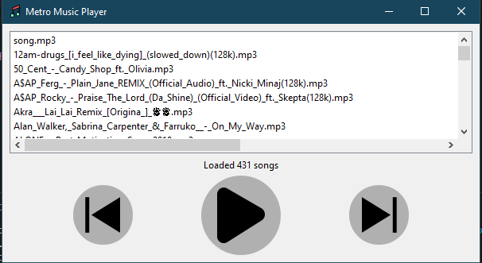

# Music Player

Music Player is a sleek and modern music player built using Python and PySide6. This application allows users to automatically load, play, and manage their music files with an intuitive graphical user interface. 



## Features

- **Play and Pause Music**: Easily control playback with dedicated buttons.
- **Next and Previous Track**: Navigate through your playlist seamlessly.
- **Visual Playlist**: View and select songs from a list.
- **Stylish Interface**: Enjoy a modern design with circular buttons and shadow effects.
- **Error Handling**: Receive feedback if a song fails to load.

## Technologies Used

- **Python**: The core programming language.
- **PySide6**: For creating the graphical user interface.
- **pygame**: For handling audio playback.

## Installation

### Prerequisites

Ensure you have Python installed on your system. You can download it from the [official Python website](https://www.python.org/).

### Steps

1. **Clone the Repository**:
    ```bash
    git clone https://github.com/jtareen/music-player.git
    cd music-player
    ```

2. **Install Dependencies**:
    ```bash
    pip install PySide6 pygame
    ```

3. **Run the Application**:
    ```bash
    python main.py
    ```

## Usage

1. **Launch the Application**:
   ```bash
   python main.py
   ```
   
2. **Load Songs**: The application will automatically load songs from the specified directory in `ui.py`. It can be changed according to your preference.

3. **Control Playback**:
   - Click the play/pause button to start or pause playback.
   - Use the next and previous buttons to navigate through the playlist.
   - Double-click a song in the list to play it.

4. **Error Handling**: If a song fails to load, an error message will be displayed.

## Project Structure

```
.
├── assets
│   ├── play.png
│   ├── pause.png
│   ├── next.png
│   └── prev.png
├── icons
│   └── icon.svg
├── scripts
│   └── songs.py
├── ui
│   └── ui.py
├── main.py
└── README.md
```

## Contributing

Contributions are welcome! Please open an issue or submit a pull request for any changes or improvements.

## License

This project is licensed under the MIT License. See the [LICENSE](LICENSE) file for details.

## Acknowledgements

- Thanks to the [PySide6](https://doc.qt.io/qtforpython/) and [pygame](https://www.pygame.org/) communities for their excellent libraries.

---
